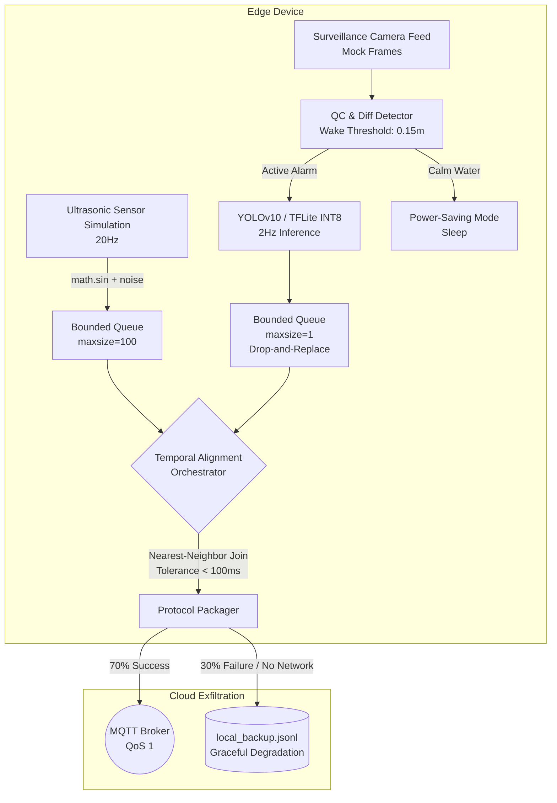

# 🌊 Edge AI Gateway: Disaster Resilience & Flood Monitoring

A highly fault-tolerant, multi-threaded Edge AI gateway designed for real-time flood and debris monitoring at Huanggang Creek. This system tackles the "NMS Latency Tax" and extreme data frequency mismatches by decoupling I/O from inference, fusing heterogeneous sensor data, and implementing robust graceful degradation for remote edge nodes.  

Imagine placing a small computer (an edge node) next to Huanggang Creek to monitor floods. It has a camera watching for driftwood and a sensor measuring water levels.  
The core problem is **Time** and **Resources**:
- The water sensor blasts data at 20 times a second (20Hz).
- The camera and AI (YOLO) are heavy, taking a long time to process, meaning they only output results 2 times a second (2Hz).
---

## 🏗️ System Architecture

The pipeline strictly decouples high-frequency scalar data from low-frequency tensor data to prevent deadlocks and Out-Of-Memory (OOM) crashes on constrained 2-Core edge hardware.  



### 1. The Sensor Thread
- Constantly generates simulated water level data at 20Hz.
- Uses a mathematical MAD Filter (Median Absolute Deviation).

If a sudden, impossible spike occurs (like a bird flying directly under the sensor), the filter silently rejects it as an anomaly so it doesn't corrupt your database.

### 2. The Vision Thread 
- Processes images, checks their quality, and runs the YOLO AI to count driftwood.
- Running AI drains battery and creates heat. This thread checks the water level first (**Power-Saving**).If the water is calm and below the danger threshold, it skips the YOLO AI entirely and goes to sleep. It only wakes up the heavy AI when an "Active Alarm" flood condition is met.
- To prevent your computer from crashing due to Out-Of-Memory (OOM) errors, it passes frames into a queue with `maxsize=1`. If the AI is too slow, it throws away the old frame and grabs the freshest one. You trade historical data to guarantee real-time stability (**OOM Prevention**).

### 3. The Fusion Orchestrator
- Takes the fast sensor data and the slow AI data and glues them together into one clean package.
- Uses the slow AI timestamp as the anchor, looks back at the fast sensor buffer, and grabs the exact water level reading that happened at that exact millisecond. It guarantees the sync error is always under 100ms.
- Edge networks (like a cellular modem in the wild) drop constantly. When this thread tries to send data to the Cloud (**MQTT**) and the network fails, it doesn't crash or lose the data. It catches the error and silently writes the payload to a local text file (`local_backup.jsonl`) to be uploaded later when the WiFi returns.

---

## 🎯 Engineering Trade-offs & Architecture Decisions

This architecture is explicitly engineered to address the core requirements of modern Edge AI systems:

### 1. System Architecture (OOM Prevention & Stability)
- **Decoupling I/O and Inference**: Python's threading module isolates the 20Hz sensor stream from the heavy 2Hz computer vision inference.
- **Queue Stability (Active Frame Dropping)**: The vision queue implements a strict `maxsize=1` constraint with `put_nowait()` and `get_nowait()` eviction logic. If the CPU bottlenecks, stale frames are actively dropped rather than accumulating in memory. We trade redundant historical data for absolute system stability and real-time freshness.
- **Deadlock Prevention**: Global `threading.Event()` hooks and queue timeouts ensure clean, safe shutdowns across all components without thread hanging.

### 2. Data Engineering (Heterogeneous Fusion)
- **Nearest-Neighbor Temporal Join**: The synchronization orchestrator "latches" onto the slower 2Hz vision timestamp. It then searches the 20Hz sensor buffer for the closest corresponding temporal data point, enforcing a strict <100ms synchronization tolerance.
- **Graceful Degradation (MQTT Fallback)**: Simulates a volatile edge network. If the cloud connection drops, the pipeline catches the failure and dynamically redirects the packaged JSON payload to a local disk append log (`local_backup.jsonl`) for future batch transmission.

### 3. Optimization (Latency & Power)
- **Power-Saving Difference Detector**: A baseline delta tracker monitors the scalar water level. If the water is calm (delta < 0.15m and level < 2.2m), the system bypasses the computationally expensive YOLO inference entirely, conserving critical edge battery life.
- **Quantized Inference**: Designed to support INT8 quantized models (`.tflite`) or NMS-Free architectures (YOLOv10) to reduce memory footprint and bypass the Non-Maximum Suppression latency tax on edge CPUs.

---

## 💻 Environment Setup

Designed and profiled on and for lightweight environments.
```plaintext
- OS: Linux Mint 22.1
- CPU: i5-9300H
- GPU: GTX 1050 3GB
- RAM: 8GB
```
### Prerequisites
1. Clone this repository.  
2. Create and activate a Python virtual environment:
   ```bash
   python -m venv env_name
   source env_name/bin/activate
   ```  
3. Install the required dependencies:
   ```bash
   pip install -r requirements.txt
   ```
   or
     
   ```bash
   pip install numpy opencv-python-headless ultralytics paho-mqtt tensorflow
   ```
   > **Note**: Linux users may need to run `sudo apt-get install libopenblas-dev liblapack-dev` if OpenCV raises backend array errors.

---

## 🚀 Execution & Results

### Running the Gateway
```bash
python final_showcase_gateway.py
```

### Expected Output & Terminal Profiling
The terminal will actively log the system state, demonstrating the power-saving mode, visual QC drops, and successful fusion joins. At t=12s, the system injects a massive debris spike to trigger the Active Alarm.

```plaintext
[Thread 1] Huanggang Creek Sensor active (20Hz)...
[Thread 2] Vision Surveillance Engine active (2Hz)...
[Thread 3] Temporal Alignment Orchestrator active...
[GATEWAY] Status: Calm (1.52m). YOLO sleeping to save power.
...
[GATEWAY] ACTIVE ALARM! (2.35m). Executing YOLO Driftwood Detection.
[FUSION ENGINE] Synced Payload Compiled!
    | Time Error: 24.15 ms | Level: 2.35m | Debris: 2
    -> [CLOUD] Upload success (MQTT QoS 1).
    -> [FATAL COMM] Network down. Triggering DLQ Local Cache.
```
### Output
Below is a output from a test run:  

  
  
  

### Local Fallback Validation (`local_backup.jsonl`)
When the network fails, payloads are serialized to disk locally. Example entries (from actual entries):

```json
{"timestamp": 1780756727.4625485, "water_level_m": 2.305, "driftwood_detections": 1, "sync_error_ms": 33.8, "ai_latency_ms": 204.12}
{"timestamp": 1780756729.2372203, "water_level_m": 2.465, "driftwood_detections": 2, "sync_error_ms": 48.25, "ai_latency_ms": 262.92}
{"timestamp": 1780756730.3978257, "water_level_m": 2.548, "driftwood_detections": 1, "sync_error_ms": 46.64, "ai_latency_ms": 265.08}
{"timestamp": 1780756732.7037566, "water_level_m": 2.605, "driftwood_detections": 1, "sync_error_ms": 36.18, "ai_latency_ms": 256.82}
{"timestamp": 1780756733.2572057, "water_level_m": 2.638, "driftwood_detections": 1, "sync_error_ms": 86.83, "ai_latency_ms": 203.24}
```

---

## Additional Notes
- Can install necessary packages manually from `requirements.txt`.
- Based on OS, actual command was `python3` and `pip3`.
- Tested and ran smoothly on another PC (`Ubuntu`).
- **Python Virtual Environments** is recommended.
- The system is built for demonstration and can be extended with real hardware integration.
